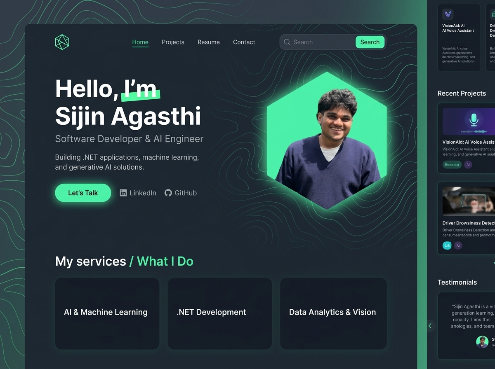

# Sijin Agasthi - Modern Developer & AI Engineer Portfolio

A modern, high-performance personal portfolio website built with a luxury dark cyberpunk/glassmorphism theme, topographic contour accents, vibrant emerald glow effects, and interactive showcases.



---

## 🌟 Highlights & Features

- **Design Aesthetic**: Matches the high-end dark slate & emerald neon UI mockup (`#0a0d14` + `#00E599`).
- **Signature Hexagon Portrait**: Glowing emerald backdrop and hexagonal mask showcasing your profile headshot.
- **Instant Photo Customizer**: Click the **"Change Photo"** badge or header button in the browser to instantly upload and preview your own real photo live! Your chosen photo is automatically remembered in your browser.
- **Resume Content Integrated**:
  - **Hero Section**: Sijin Agasthi, Software Developer & AI Engineer, core value proposition.
  - **"What I Do" (Services)**: AI & Machine Learning, .NET Development, Data Analytics & Vision.
  - **Interactive Project Showcase**:
    - *VisionAid: Personalized Voice Assistant for the Visually Impaired* (Raspberry Pi, Multimodal Generative AI, LLMs).
    - *Driver Drowsiness Monitoring & Detection* (LSTM-KNN, Eye Aspect Ratio, Alarm Mechanism - 81.5% accuracy).
  - **Experience & Education**: Distinct Infotech Solutions, AI Fire Lab, B.Tech from Vimal Jyothi Engineering College.
  - **Certifications**: IIT Madras (Python for Data Science), White Track Technologies (Power BI), CUSAT (Robotics), IIT Delhi (Cyber Security).
  - **Contact & Connect**: Direct links to Kannur, Kerala location, email (`sijinagsthi111@gmail.com`), and phone (`+91 8593990351`) with one-click clipboard copy.

---

## 🚀 How to Run Locally

You can open the portfolio directly in any modern browser:

1. Double click [`index.html`](index.html) to open in Chrome, Edge, or Brave.
2. Alternatively, run a lightweight local server:
   ```bash
   npx serve .
   # or with Python:
   python -m http.server 8000
   ```
   Then open `http://localhost:8000` in your browser.

---

## 📸 Updating Your Profile Photo Permanently

To make your personal photo permanent in the codebase:
1. Copy your photo into the `assets/` folder and name it `profile.jpg` (or `.png`).
2. Alternatively, use the interactive **"Change Photo"** button right in the webpage!

---

## 🌐 Free 1-Click Deployment

- **GitHub Pages**: Push this repository to GitHub and enable Pages in repository settings under *Settings > Pages*.
- **Vercel / Netlify**: Drag-and-drop this folder directly into [Netlify Drop](https://app.netlify.com/drop) for instant global hosting.
